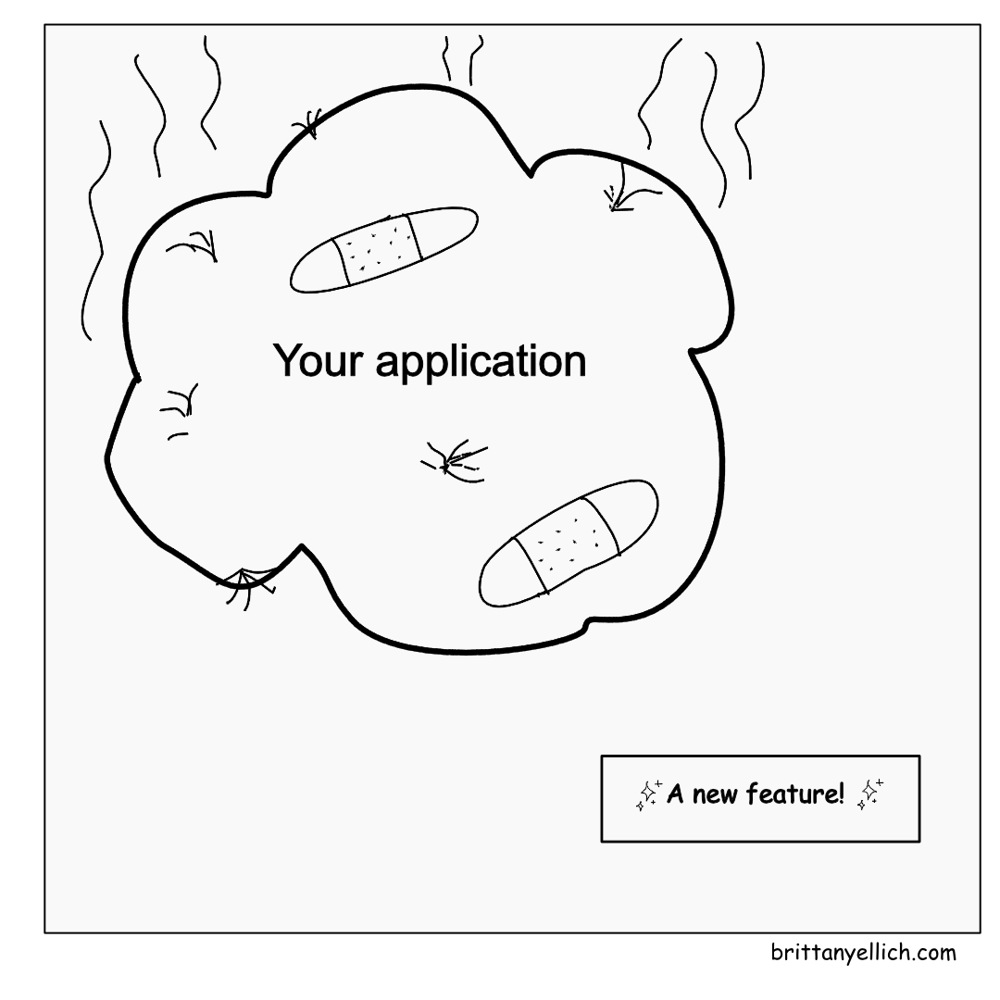
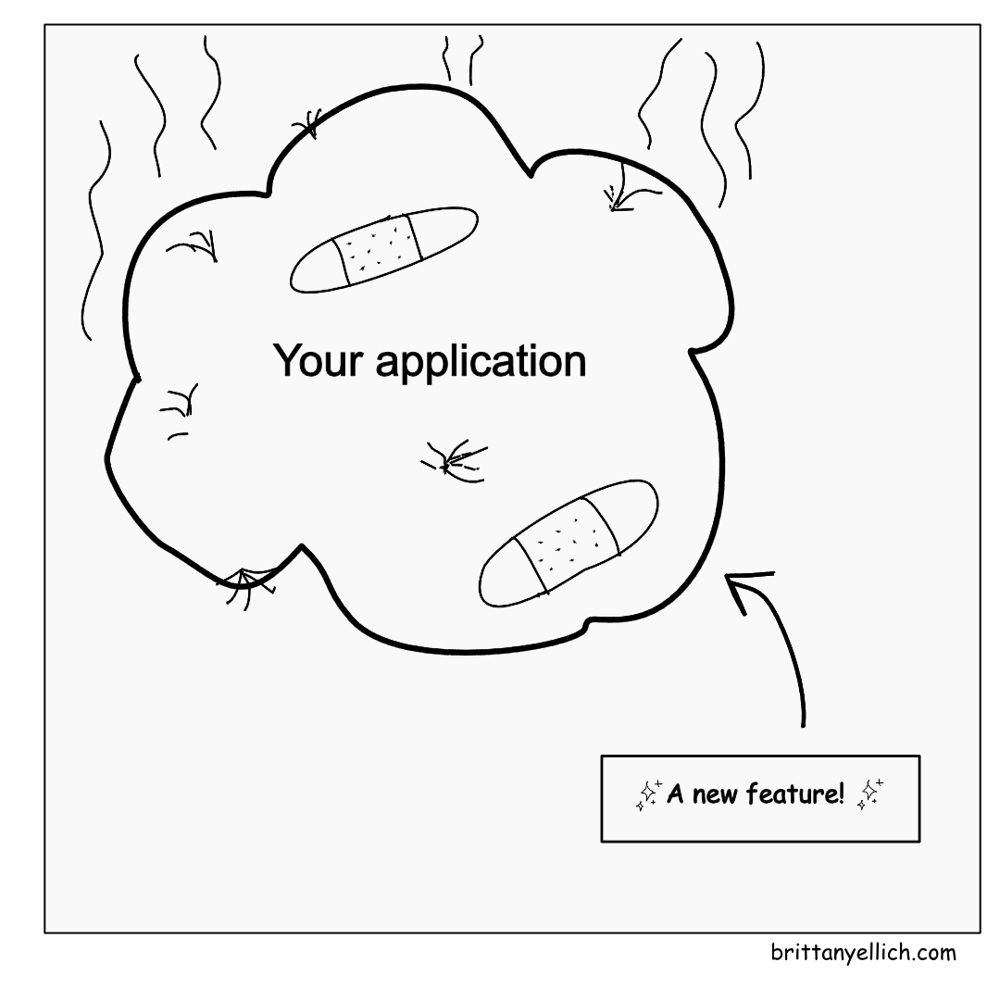

# From Rewrites to AI Agents for App Modernization

  

    Brittany Ellich, GitHub | <a href="https://brittanyellich.com" target="_blank">brittanyellich.com</a>
  

  <a href="https://github.com/brittanyellich/rewrites" target="_blank">
    <carbon:logo-github /> brittanyellich/rewrites
  </a>

<!--
Getting started.
Welcome.
Check out the slides at the repo link.
-->

---
layout: default
image: 'images/1.png'
---

    

<!--
This is your software system.
-->

---
layout: default
image: 'images/2.png'
---

    

<!--
Okay maybe this is more realistic. It's a bit hairy. It has bandaids. It has code smells.
-->

---
layout: default
image: 'images/mountain.png'
---

    

<!--
Over time, software systems build a mountain of tech debt
-->

---
layout: default
---

    

<!--
Eventually, a feature comes along. Your PM wants something new which requires a significant shift in your application.
-->

---
layout: default
---

    

<!--
You have to integrate it with your system, but you've hit a wall. There's been enough complaints. 
-->

---
layout: image-right
image: 'images/4.png'
---

"It would be faster to just rewrite the whole thing"

Does this sound familiar?

<!--
Someone on your team (maybe you) suggests a full rewrite, a brand new application.

Raise your hand. [Pause]

If you haven't seen this yet, you almost certainly will.
-->

---
layout: statement
---

You're wrong.

(probably)

<!--
Pause. <click> Probably

I'm going to tell you why that's wrong in three points.
-->

---
layout: intro
---

# From Rewrites to AI Agents for App Modernization

## Brittany Ellich, GitHub

[brittanyellich.com](https://brittanyellich.com)

I do lots of things on the internet:

- The Balanced Engineer Newsletter
- The Overcommitted Podcast
- Find me on Bluesky, LinkedIn, TikTok, or YouTube!

<!--
Welcome to my talk: From Rewrites to AI Agents for App Modernization

Hello my name is Brittany Ellich - Software engineer at GitHub, speaker, and educator helping developers build better software, stronger careers, and a more inclusive tech industry.

-->

---
layout: default
---

# What we're going to talk about

- Refactor, don't rewrite: The top 3 arguments and why they're wrong
- Getting AI to help you: How to use agents today

<!--
Here's what we're going to talk about today
-->

---
layout: section
---

# Refactor, don't rewrite

The top 3 arguments and why they're wrong

<!--
Everyone I've worked with probably thinks this part of the talk is about when we worked together. 

The answer is yes.

Rewrites have been the majority of my career.
-->

---
layout: image-right
image: 'images/5.png'
---

# 1. It will be faster to just rewrite it

<!--
"How many of you have heard 'it'll be faster to rewrite'? Keep your hands up if it was actually faster..."

When you plan your app, you're thinking about the feature and some of the scope of the rewrite, but as anyone who has ever guessed a story point can tell you, humans are really bad at estimating, and this is estimating on a huge scale.
-->

---
layout: image-right
image: 'images/6.png'
---

# 1. It will be faster to just rewrite it

<!--
You're focused on the 20% that's broken, but you have to rewrite the 80% that works fine
-->

---
layout: image-right
image: 'images/7.png'
---

# 1. It will be faster to just rewrite it

<!--
Not only that, there's the other app you have to maintain and support during that same time.
And that's just for support. That means no major new features for customers for the entirety of the rewrite time.
-->

---
layout: image-right
image: 'images/8.png'
---

# 1. It will be faster to just rewrite it

No, it won't be.

<!--
And, oh yeah, you have to move all that data over and decommission the old app
-->

---
layout: image-right
image: 'images/14.png'
---

# 2. We will move faster with clean code.

<!--
Folks think they'll be able to clean everything up and it will get into a perfectly clean state with no problems.
-->

---
layout: image-right
image: 'images/15.png'
---

# 2. We will move faster with clean code.

<ul v-click>
    <li>"If we start over, we can do it right this time"</li>
    <li>"We'll avoid all the mistakes from the legacy system"</li>
    <li>"The new code will be so much cleaner and more maintainable"</li>
</ul>

<!--
Here's what this sounds like - Click
-->

---
layout: image-right
image: 'images/16.png'
---

# 2. We will move faster with clean code.

Production applications are inherently messy - and that's a feature, not a bug.

<ul>
    <li v-click>Your "ugly" edge cases = real business requirements discovered through user feedback</li>
    <li v-click>Workarounds = institutional knowledge</li>
    <li v-click>Weird conditionals = patches for critical customer scenarios from a 2AM outage</li>
    <li v-click>"Unnecessary" features = critical dependencies for actual users</li>
</ul>

<!--
Messiness reflects the real-world complexity. 

Click > Your "ugly" edge cases represent actual business requirements.
Click >The workarounds encode institutional knowledge. 
Click >That weird conditional isn't poor coding - it's handling a critical customer scenario someone discovered at 2 AM during an outage.
Click >Accumulated complexity serves users: Every seemingly unnecessary feature exists because someone, somewhere, depends on it.
-->

---
layout: image-right
image: 'images/17.png'
---

# 3. The current technology stack is holding us back.

<ul v-click>
    <li>"If we rewrite in X, we will solve all our performance problems"</li>
    <li>"We're spending too much time fighting against outdated tools"</li>
    <li>"New developers can't be productive in this legacy stack"</li>
</ul>

<!--
A lot of times these efforts come with an excuse for the team to learn a new technology. But anything created in the last decade is probably fine. It's not the technology, it's how you use it.

click.
This is what this sounds like.

But here's the thing:

It's easy to learn a new technology, but hard to learn it well. That learning is going to be an undertaking on its own. 

While I love a greenfield project as much as the next engineer...

Refactoring a legacy codebase is arguably much more technically interesting. 

I argue it's more impactful to modernize a legacy codebase in less time and a technology the team is already familiar with than to rewrite a brand new one.
-->

---
layout: image-right
image: 'images/18.png'
---

# 3. The current technology stack is holding us back.

It isn't.

<!--
Good software design principles apply regardless of the tech stack.
-->

---
layout: center
class: text-center
---

# Refactor, don't rewrite.

You don't need a rewrite.

It will take too long.

All production applications are messy.

You won't suddenly work better by adopting a new technology.

<!--
There are some cases where a rewrites makes sense. But if you can't clearly articulate why a rewrites is necessary, refactor instead.

You probably don't need a rewrite.
It will probably take too long.
Your production application will not be the perfect, bug-free, clean-code space you think it will be.
You won't suddenly work better by adopting a new technology.
-->

---
layout: image-right
image: 'images/mountain.png'
---

# "So if rewrites are out, how do we tackle our mountains of tech debt?"

<!--

-->

---
layout: section
---

# Getting AI to help you

How to use agents today

<!--
Would this be a talk in 2025 if I didn't mention AI?
-->

---
layout: image
---

<!--
An aside: I work at GitHub, but I'm an engineer, not in sales. I'm not here to sell you all on Copilot. That's not my job. But this is the tool I've used the most.
-->

---
layout: default
---

# Coding agent use cases

    

        <ul>
            <li v-click>Increasing test coverage</li>
            <li v-click>Searching your codebase to find inconsistent approaches</li>
            <li v-click>Taking patterns and applying them across your codebase incrementally</li>
            <li v-click><a href="https://github.blog/ai-and-ml/github-copilot/how-the-github-billing-team-uses-the-coding-agent-in-github-copilot-to-continuously-burn-down-technical-debt/">How the GitHub billing team uses the coding agent in GitHub Copilot to continuously burn down technical debt</a></li>
        </ul>
    

    

        
    

<!--
These are all great use cases because I know that they work

There are ways to make this work better (ask me about them/read my blog post about it!)
-->

---
layout: default
---

# Increasing test coverage with the coding agent in GitHub Copilot

> Analyze the billing components directory and create tests for untested code paths. Focus on:

> - Component rendering and props handling
> - User interactions (clicks, forms, keyboard events)
> - Conditional rendering (if/else branches)
> - State changes and error states
> - Async operations and edge cases

> Use React Testing Library and Jest following our existing patterns. Prioritize components with the lowest coverage first.

<!--
Increasing test coverage is the place to start for refactors to make sure you don't break anything.
Note we are looking at specific folders, not the entire application
-->

---
layout: default
---

# Searching your codebase to find problematic code with the coding agent in GitHub Copilot

> We want to identify and fix React anti-patterns and potential issues in our codebase. Please search through our React components and JavaScript files to find:

> **Direct DOM manipulation**: Identify any direct use of document.getElementById, querySelector, or other DOM methods that bypass React

> Please create a summary report showing:
> - File paths and line numbers for each issue
> - Brief explanation of why each pattern is problematic
> - Suggested fix for each case

> Focus on the /src/components directory first.

---
layout: default
---

# Taking patterns and applying them across your codebase incrementally

> We're standardizing on try-catch blocks with our custom ErrorBoundary 
component. Use this PR as an example to replace console.error() 
calls in the src/api directory.

> **Pattern to Follow:**
> - Replace console.error() with proper error handling
> - Wrap API calls in try-catch blocks
> - Use our ErrorService.logError() for consistent logging
> - Return structured error objects instead of throwing

<!--
Create the first step and ask the agent to apply it to the rest of your application (one folder at a time)
-->

---
layout: image-right
image: 'images/valley.png'
---

# Turn your tech debt mountains into managed terrain

- Refactor, don't rewrite
- Getting AI to help you: How to use agents today

<!--

-->

---
layout: default
---

# Homework

Make a list of tech debt problems that you have been putting off and give them to an AI Agent to handle them.

## Resources

- Article: [How the GitHub billing team uses the coding agent in GitHub Copilot to continuously burn down technical debt](https://github.blog/ai-and-ml/github-copilot/how-the-github-billing-team-uses-the-coding-agent-in-github-copilot-to-continuously-burn-down-technical-debt/)

## Thank you!

My website is [brittanyellich.com](https://brittanyellich.com), let's be internet friends!

<a href="https://github.com/brittanyellich" target="_blank">
    <carbon:logo-github />
</a>

<a href="https://www.linkedin.com/in/brittanyellich/" target="_blank">
    <carbon:logo-linkedin />
</a>
